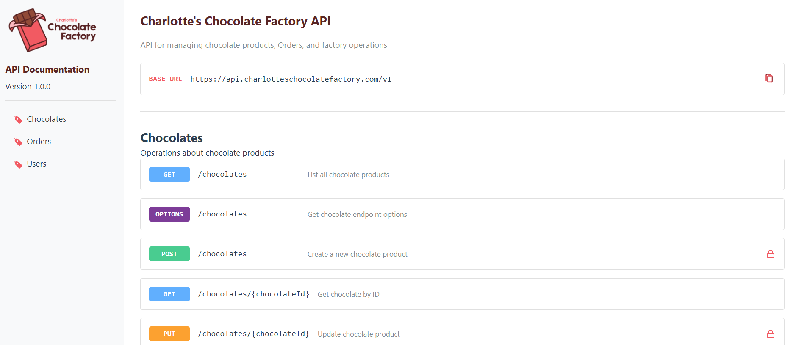

# YAML Open API Spec to HTML API Docs Converter

This repo contains a python function that takes an input `.yaml` file that's an Open API spec and creates a static `.html` file containing nicely formatted API docs, specifically to be able to host on Github pages.

You can see my example site at https://charlottetowell.github.io/yaml-to-html-api-docs/ - a mock API for "Charlotte's Chocolate Factory"



## Current Features

- Interactive side menu with extracted tags
- Customisable colours, logo, etc as per [customisation options](#customiation-options)
- Endpoint request & response schema displayed


## How to use

1. Clone this repository:
   ```bash
   git clone https://github.com/charlottetowell/yaml-html-api-docs.git
   ```

2. Install the required dependencies:
   ```bash
   pip install -r requirements.txt
   ```

3. Replace `swagger.yaml` with your Open API Spec

2. Run the converter with the input & output file names (if renaming, be sure to also update `deploy.yml` workflow accordingly):
   ```bash
   python yaml_to_html_converter.py swagger.yaml index.html
   ```
4. Set up Github Pages to use the Github Workflow Action as the source (`settings > pages > source: Github Actions`) - this will use `deploy.yml`

### Customiation Options

#### Colours

See `styles/variables.css` to update CSS things like colours, typography, spacing, etc.


#### Logo

Place a `logo.png` file in the root directory

#### Anything Else
The entire thing is just a html project, all files & components can be found and modified as needed :)
